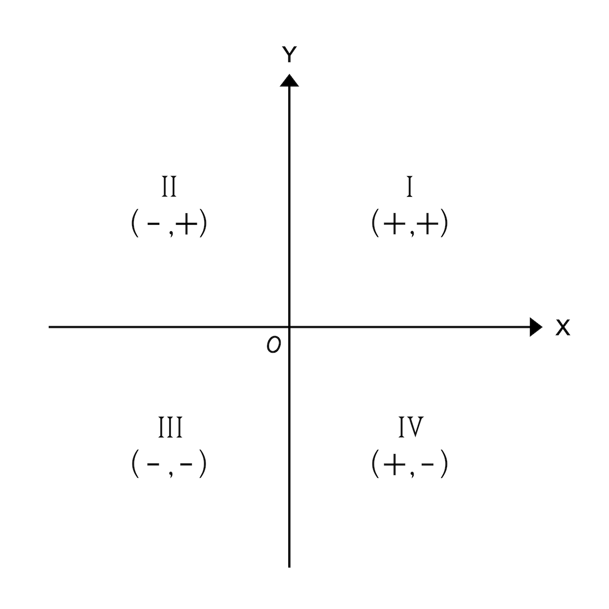

# 1115 - Quadrant

## Question

- Write a program to read the coordinates (X, Y) of an indeterminate number of points in Cartesian system. For each point write the quadrant to which it belongs. The program finish when at least one of two coordinates is NULL (in this situation without writing any message).

## Input

- The input contains several tests cases. Each test case contains two integer numbers.

## Output

- For each test case, print the corresponding quadrant which these coordinates belong, as in the example.

| Input Sample | Output Sample |
| ------------ | ------------- |
| 2 2          | First         |
| 3 -2         | Fourth        |
| -8 -1        | Third         |
| -7 1         | Second        |
| 0 2          |               |

